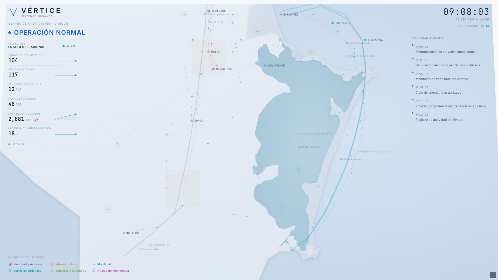
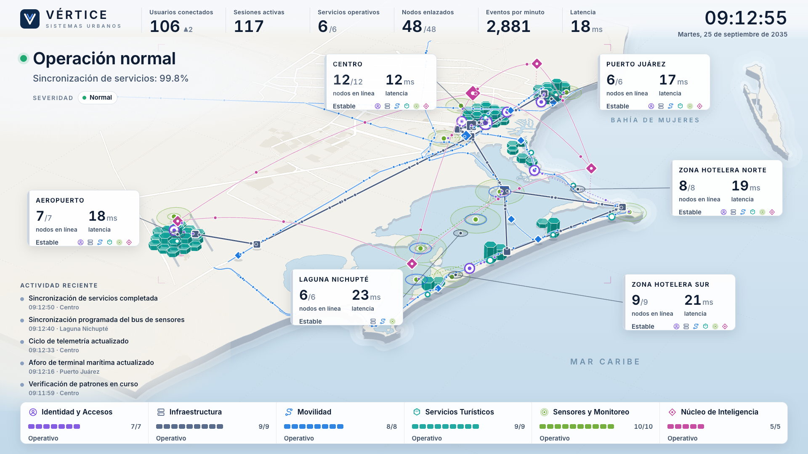
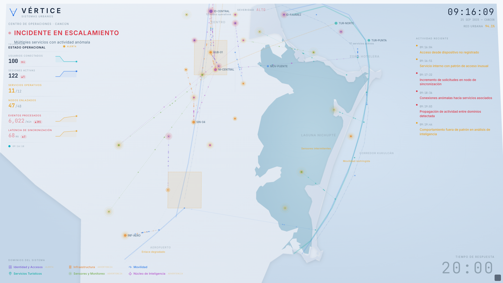
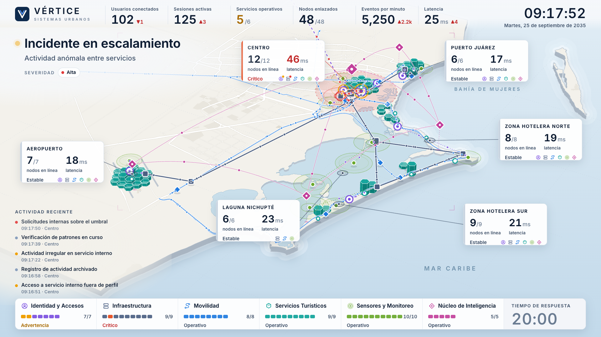
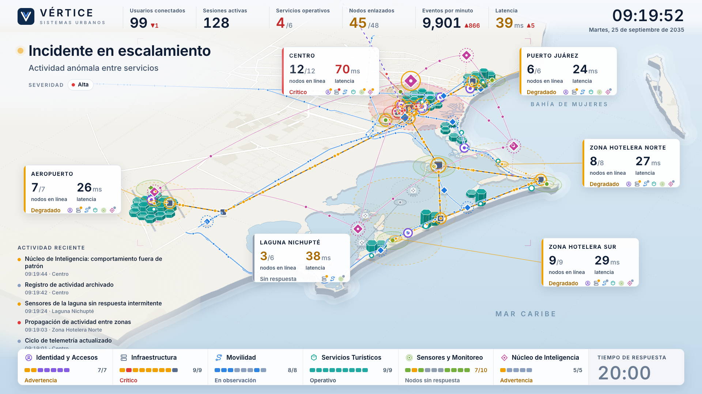

# LED central — rediseño estructural (VÉRTICE)

Rama: `feat/central-command-claude-redesign`. Alcance de esta entrega: **Operación normal** y **Incidente en escalamiento**
a 1920×1080. Los estados 2, 4, 5, 6 y 7 funcionan con el mismo motor pero **no están pulidos**.

| Antes | Después |
|---|---|
|  |  |
|  |  |
| |  |

`after-03a` = 09:17:52 (localizado en el Centro) · `after-03b` = 09:19:52 (propagado; el Núcleo se degrada al final).

## Auditoría (verificada en el código anterior)

1. **Estado narrativo.** `isEscalating = state !== 'OPERACION_NORMAL'` hacía que *recuperación* y *contención exitosa* se
   comportaran como escalamiento (pulsos más rápidos, textos "Enlace degradado" fijos). Ahora la visualización reacciona
   a una **fase semántica** (`normal · observación · investigación · escalamiento · correlación · respuesta · recuperación ·
   contención exitosa · contención incompleta`, `src/world/scenario.ts`) y, sobre todo, al **estado de cada nodo**.
2. **Coherencia del modelo.** 53 nodos dibujados vs 48 declarados; `servicesUp × 1.5` daba más servicios en una zona que
   en todo el sistema; el estado era por dominio completo (todos los nodos de Infraestructura se "alertaban" a la vez, sin
   localización); "Servicios preservados 5/6" no salía de ninguna cuenta. Ahora hay un **único modelo**
   (`src/world/model.ts`: 6 zonas · 6 dominios · 48 nodos) del que se derivan *todos* los números.
3. **Geografía.** El "continente" era el límite administrativo municipal simplificado a 55 puntos, las vialidades estaban
   "trazadas a mano", la trama urbana era inventada, varios nodos caían en el mar y el encuadre usaba constantes a ojo
   (y un `rotateX` CSS sobre un mapa plano). Ahora: OSM real (costa, Laguna Nichupté como multipolígono, vialidad,
   aeropuerto, uso de suelo) y una **proyección con perspectiva cuyo encuadre se calcula** de los límites proyectados.
4. **Composición.** Mapa + HUD encima: panel izquierdo tapando la ciudad, texto de 9–12 px ilegible en LED, leyenda
   inferior decorativa. Ahora la información vive en el territorio (ver abajo).
5. **Marca.** Isotipo de dos líneas + punto, genérico; descriptor a 9.5 px.
6. **Detalles.** Métricas con seno + jitter sin causa narrativa; sparklines de datos inventados; fecha fija; fuentes por CDN
   y metadatos de `bolt.new` en `index.html` (la LED debe funcionar sin red).
7. **Riesgo de guion en el feed.** El feed anterior enumeraba la cadena causal con horas exactas (acceso → nodo →
   propagación → Núcleo) y textos idénticos a la evidencia de las estaciones.

## Modelo del mundo

- `src/world/model.ts` — zonas (Centro, Puerto Juárez, Zona Hotelera Norte/Sur, Laguna Nichupté, Aeropuerto), 48 nodos
  colocados **sobre geografía real** (sobre vialidades reales; sensores en el agua de la laguna), enlaces, corredores.
  En desarrollo avisa por consola si algún nodo cae fuera de su medio.
- `src/world/scenario.ts` — cronología canónica (09:16:04 → 09:22:30) como *beats* con hora simulada. La LED no altera la
  historia: el Núcleo se degrada a las 09:19:44, **después** de la propagación.
- `src/world/derive.ts` — funciones puras: estado de nodos → resúmenes por dominio/zona, servicios operativos, nodos
  enlazados, latencia global (= promedio de las latencias de zona ponderado por nodos), sincronización.
- `src/world/useWorld.ts` — reloj simulado, contadores con ruido determinista y efectos causales.

Definiciones (una sola vez):
- **Nodos enlazados** = nodos que no están *sin respuesta* ni *aislados* (48/48 → 45/48 si tres sensores dejan de responder).
- **Servicios operativos** = dominios sin nodos críticos, caídos o aislados (6/6 → 5/6 al volverse crítico SIN-04).
  El cierre "Servicios preservados: 5/6" sale de la misma cuenta cuando SIN-04 queda aislado.
- Usuarios ↓ mientras sesiones ↑ (104 → 102 → 98 / 117 → 121 → 126) por efectos ligados a beats concretos.

## El territorio es la interfaz

Cada dominio tiene lenguaje espacial y color propios (`src/map/DomainLayers.tsx`, `FlowCanvas.tsx`):

| Dominio | Lenguaje |
|---|---|
| Movilidad | corredores reales (Kukulcán, Puente Nichupté, Colosio, Bonampak…) con vehículos que se frenan con la latencia |
| Servicios turísticos | concentraciones: columnas hexagonales sobre la franja hotelera, terminal y puerto |
| Sensores y monitoreo | puntos con cobertura sobre el terreno y pings (también sobre la laguna) |
| Infraestructura | hubs cuadrados y troncal; los paquetes se ponen ámbar/rojos donde hay actividad anómala |
| Identidad y accesos | anillos de acceso, sesiones sobre enlaces; la sesión anómala **entra desde fuera** del territorio |
| Núcleo de Inteligencia | capa transversal elevada de correlación (arcos sobre el terreno, nodos con proyección vertical) |

La instrumentación está anclada a su zona (tarjetas con nodos en línea, latencia local y servicios presentes); la
telemetría global es una franja superior; los dominios se muestran como 48 segmentos (uno por nodo) abajo.

## Decisiones que conviene revisar

- **Qué muestra la LED del incidente.** Se localiza espacialmente (Centro → troncal → zonas → laguna → Núcleo) pero **no
  rotula identificadores** (`SIN-04` solo aparece en el desenlace, cuando `flags.reveal`), y el feed usa redacción
  no canónica y sin usuarios/dispositivos. Aun así, el nodo crítico es visible en el Centro y el Núcleo se degrada al
  final (coherente con el canon). Si en el piloto revela demasiado, se pueden suavizar `BEATS` sin tocar el motor.
- **Ámbito de "servicios".** "Servicios preservados: 5/6" (texto canónico) se interpreta como los **6 dominios de servicio**.
- **Modo claro vs `AGENTS.md`** ("Oscuro, premium, operativo"): esta LED sigue la dirección indicada por el equipo
  (modo claro). `AGENTS.md` no se modificó.
- **Alturas de las columnas hexagonales**: la variación entre celdas es determinista pero *no* proviene de datos.

## Pendiente

Estados 2, 4, 5, 6 y 7 (funcionales, sin pulir); rutas que cambian en Movilidad; sonido; verificación en la LED real
(distancia de lectura); revisión de marca por diseño.

## Operación

```bash
npm run dev          # http://localhost:5173  (uso normal; sin parámetros)
npm run build        # typecheck + build
npm run geo          # regenera src/map/data/cancun-osm.json desde OpenStreetMap
```

Solo desarrollo: `?speed=6` acelera el reloj simulado.
Teclas: `1–7` estado · `R` restablecer · `D` panel de facilitación · `F` pantalla completa · `M` tema · `Espacio` cuenta regresiva.

Datos © colaboradores de OpenStreetMap (ODbL 1.0), ver `src/map/data/SOURCE.md`.
