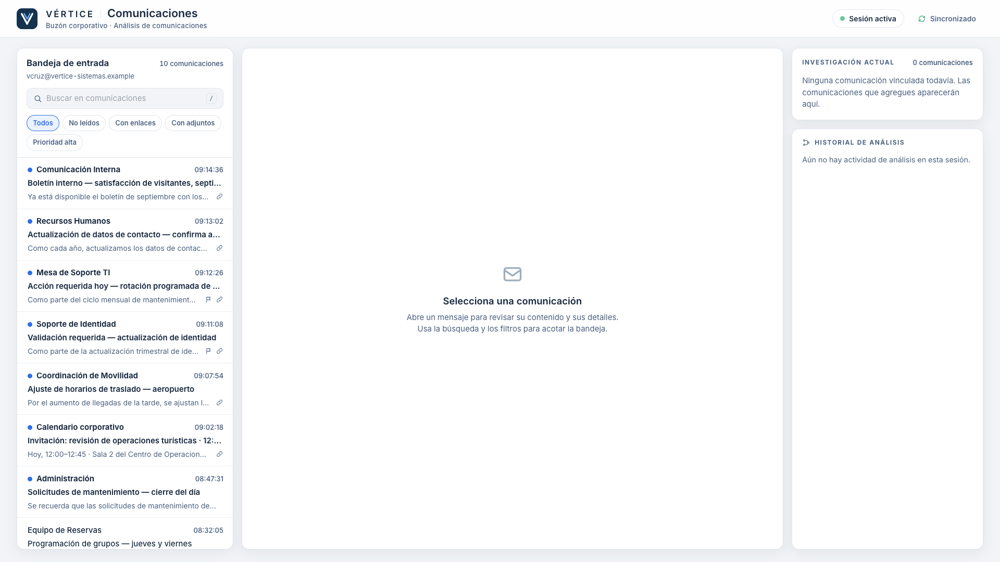
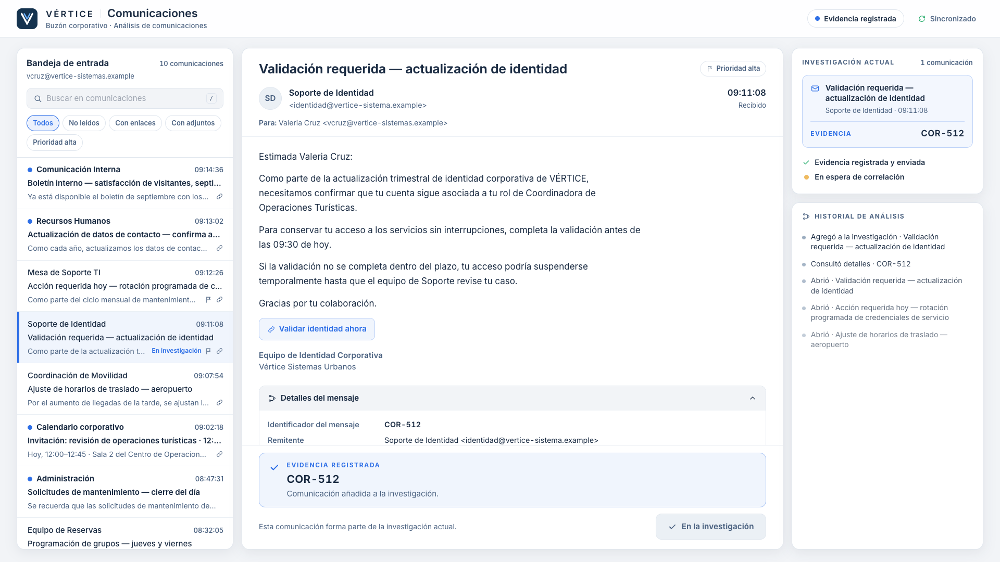

# Estación 01 — Comunicaciones (v1)

Cliente corporativo de correo + análisis de comunicaciones dentro de VÉRTICE. Es el **patrón** para las demás estaciones
(marco común, cliente de misión, lógica de descubrimiento separada de datos y presentación).

| Activa | Evidencia registrada |
|---|---|
|  |  |

## Cómo abrirla

```bash
npm run dev
```

- `http://localhost:5173/` → LED central · `http://localhost:5173/station/comunicaciones` → Comunicaciones (otra pestaña).
- Con `?dev=true` aparece un botón `dev` (abajo a la izquierda): iniciar misión sin LED, marcar `COR-512`, volver a ACTIVE,
  reiniciar, forzar ayudas y alternar tema. `?theme=midnight` abre en MIDNIGHT. Sin `?dev=true` no hay controles ocultos.
- La LED (`D` → «Abrir estación Comunicaciones») abre la ruta. La sección «Forzar evidencia» de la LED es un atajo de pruebas.

## Dónde está cada cosa

| Qué | Dónde |
|---|---|
| Contenido canónico (10 correos, incluido `COR-512`) | `src/stations/communications/data.ts` |
| Lógica de descubrimiento, fases, filtros, ayudas | `src/stations/communications/logic.ts` |
| Presentación | `CommunicationsStation.tsx`, `MessageList/Reader.tsx`, `InvestigationRail.tsx` |
| Marco reutilizable (cabecera, estado, sincronía) | `src/stations/shell/` |
| Cliente de misión de una estación | `src/mission/useMissionClient.ts` |
| Transporte del modo portátil (BroadcastChannel) | `src/mission/broadcastTransport.ts` |
| Selección de transporte (único punto de cambio) | `src/mission/createTransport.ts` |
| Rutas | `src/entry.tsx` (por `pathname`, sin React Router) |

Canon usado (`docs/03-game-design.md`, Hilo A): 09:11:08 · `COR-512` · «Validación requerida — actualización de identidad» ·
dominio oficial `@vertice-sistemas.example` · dominio falso `@vertice-sistema.example` · correos normales mezclados y un
distractor urgente legítimo (`COR-513`). Los `COR-506…515` restantes son identificadores ordinarios de mensaje.

## Cómo se registra COR-512

1. El alumno abre el correo, revisa remitente/dominio/horario y abre **Detalles del mensaje** (aquí está el identificador).
2. Pulsa **Agregar a la investigación** (acción explícita; abrir el mensaje no basta).
3. `submitToInvestigation()` (`logic.ts`) emite **un** evento, con la API real del motor:

   ```ts
   { type: 'EVIDENCE_DISCOVERED', evidenceId: 'COR-512', source: 'comunicaciones' }
   ```
4. Cualquier otra comunicación → «Sin coincidencia suficiente con el incidente actual.» (sin bloqueo, sin decir cuál es).
   Reenviar `COR-512` no emite nada. La fase se **deriva** de la misión (`WAITING → ACTIVE → EVIDENCE_FOUND → MISSION_FINISHED`);
   no hay estado global paralelo.

Ayudas (solo sistema, sin facilitador): a los 3 min sin evidencia (o 3 intentos fallidos) aparece una nota general; a los 5 min,
«compara remitente, dominio y horario» (tomado de la tarjeta de rol del Analista de Comunicaciones). No se señala ningún mensaje.

## Reset

`MISSION_RESET` (LED: «Restablecer»; estación con `?dev=true`) devuelve la estación a «Estación preparada» y limpia su UI local.

## Transporte: modo portátil y modo distribuido

```text
Modo portátil (actual, soportado):   BroadcastChannel   → 1 computadora, pestañas del mismo navegador, sin red
Modo distribuido (futuro):           WebSocketTransport → varias computadoras (no implementado)
```

La estación solo depende de `MissionTransport`; no sabe cuál se usa. Modelo de autoridad del modo portátil: **VÉRTICE central = host**
(guarda el registro de eventos de la sesión) y **las estaciones = clientes** (piden sincronización cada vez que se suscriben:
montaje, StrictMode, HMR, recarga o apertura tardía, y aplican el replay del host). Detalle en `docs/12-modos-de-ejecucion.md`.

Flujo soportado hoy — una computadora, un navegador:

```text
Pestaña/Ventana 1 → VÉRTICE (/)
Pestaña/Ventana 2 → Comunicaciones (/station/comunicaciones)
Pestaña/Ventana 3…6 → Identidad · Infraestructura · Inteligencia · Respuesta (futuras)
```

Funciona con una sola pantalla (alternando pestañas) o con varias.

### Recargas
- **Recargar la estación:** recupera la sesión en curso desde VÉRTICE (misión, `COR-512` si ya estaba registrada). Solo se pierde su UI local
  (mensaje abierto, leídos, búsqueda/filtro, historial de análisis, contador de ayudas).
- **Recargar VÉRTICE (host):** reinicia la sesión (misión sin iniciar; las estaciones vuelven a «Estación preparada»).

### Para el modo distribuido (no implementado)
Implementar `WebSocketTransport` y devolverlo en `getMissionTransport()`; añadir un Mission Server que sea el host. La estación no cambia.
Deuda deliberada: ver `docs/12-modos-de-ejecucion.md`.

Limitación actual: la estación no muestra hora de misión (no hay reloj compartido todavía).
