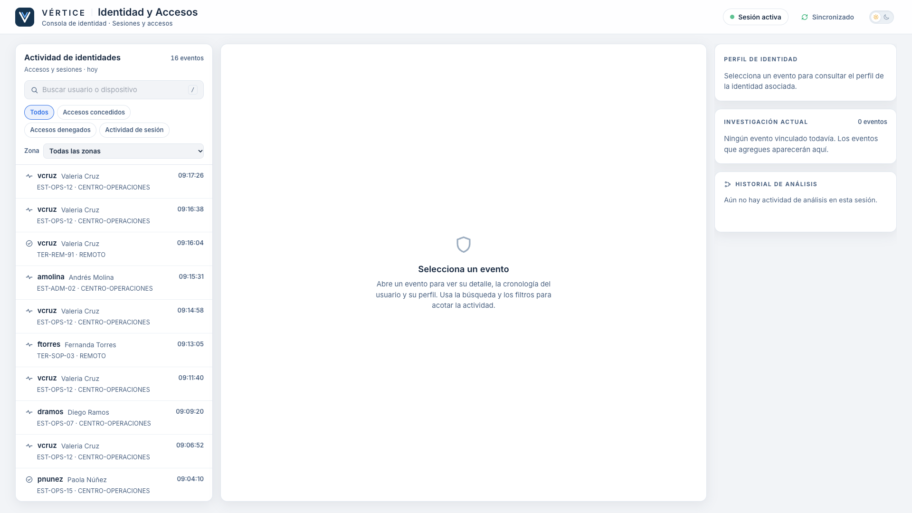
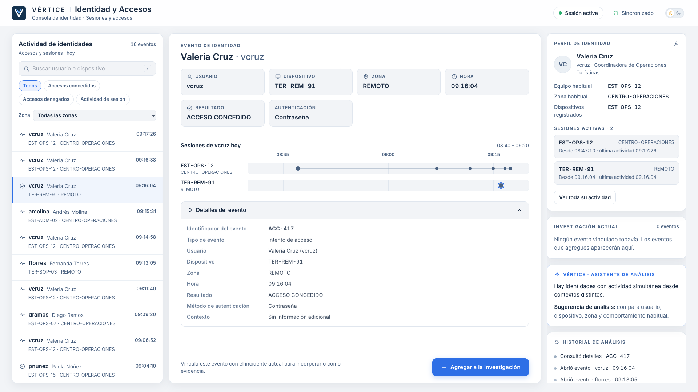
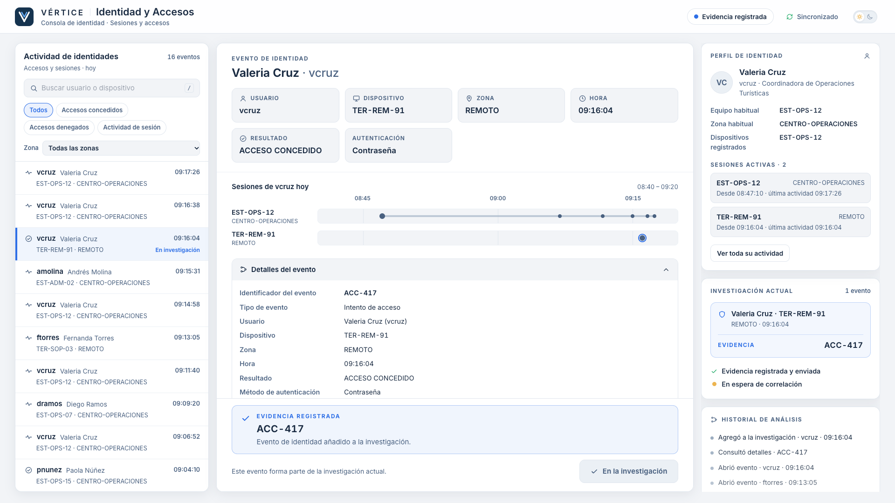
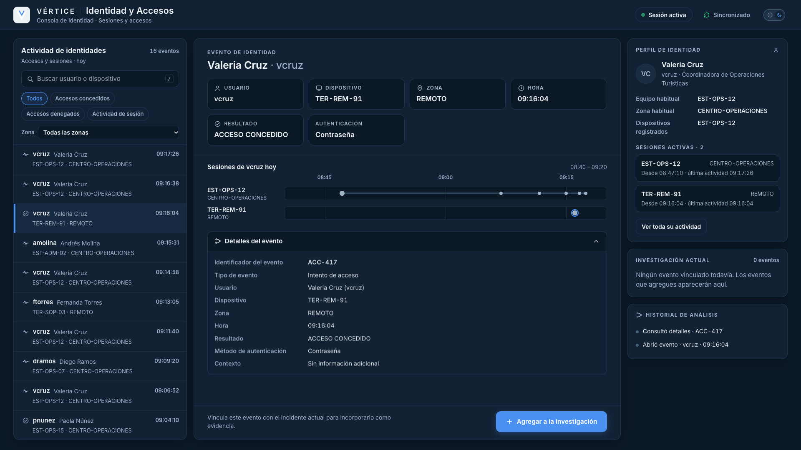

# Estación 02 — Identidad y Accesos (v1)

Consola de identidad de VÉRTICE: actividad de accesos y sesiones, perfil de la identidad y cronología de sesiones por usuario.
Reutiliza el patrón técnico de Comunicaciones (marco, cliente de misión, fase derivada, acción explícita) con composición propia.

| Activa | Evento abierto | Evidencia registrada |
|---|---|---|
|  |  |  |

Variante MIDNIGHT (el selector sol/luna está en la cabecera, sin parámetros): 

## Propósito y ruta

Determinar **qué identidad presenta un comportamiento incompatible con su patrón habitual** (`docs/03-game-design.md`, Hilo B).

```text
http://localhost:5173/station/identidad     (junto a  /  y  /station/comunicaciones, en el mismo navegador)
```

Modo portátil: una computadora, sin red. Usa `useMissionClient()` y el transporte existente; no añade transporte, servidor ni WebSocket.

## Evidencia y flujo de descubrimiento

Evidencia: **`ACC-417`** · fuente: **`identidad`** · evento canónico: `09:16:04 · vcruz · TER-REM-91 · REMOTO · ACCESO CONCEDIDO`.

1. El alumno explora la actividad (16 eventos; búsqueda por usuario/dispositivo, filtro por resultado y por zona).
2. Al abrir un evento ve sus datos, el **perfil** de la identidad (equipo y zona habituales, dispositivos registrados, sesiones activas)
   y la **cronología de sesiones** del usuario. El identificador está en **Detalles del evento**.
3. La incompatibilidad se descubre por comparación: `vcruz` mantiene actividad continua en `EST-OPS-12` / `CENTRO-OPERACIONES`
   mientras aparece una sesión concedida desde `TER-REM-91` / `REMOTO`. Nada se marca como «sospechoso»; `ACC-417` se ve como
   cualquier otro acceso concedido.
4. Con **Agregar a la investigación** (acción explícita; abrir el evento no basta) se emite **una vez**:

   ```ts
   { type: 'EVIDENCE_DISCOVERED', evidenceId: 'ACC-417', source: 'identidad' }
   ```
5. Otro evento → «La actividad seleccionada no presenta suficiente incompatibilidad con el perfil conocido. Revisa usuario, dispositivo,
   zona y contexto.» (sin bloquear ni decir qué campo). Reenviar `ACC-417` no emite nada.
6. Tras registrar: «EVIDENCIA REGISTRADA · ACC-417», «Evidencia registrada y enviada» y «En espera de correlación». La estación sigue
   activa. Identidad **no** muestra `COR-512`, `NOD-204` ni `AGR-27`, ni relaciona el acceso con el correo: eso es razonamiento del equipo.

Distractores canónicos incluidos (sin subtramas): `pnunez` con acceso denegado seguido de concedido, y `ftorres` con una sesión remota
legítima respaldada por una ventana de soporte programada (regla del rol: un acceso fallido no necesariamente es un ataque).

## Interacción con el Mission Engine (primera convergencia)

La estación **no** decide la correlación. Cuando el motor tiene `COR-512` y `ACC-417` (en cualquier orden), su reducer establece
`identityCorrelationEstablished = true`; la cronología existente hace que VÉRTICE pase a «Correlación de identidad establecida»
al llegar a `09:20:11`. No se adelanta el reloj ni se cambia la historia.

Si `COR-512` ya estaba registrada al abrir la estación, esta recupera la sesión por el replay del host (queda **ACTIVE**, no
`WAITING`): el descubrimiento de `ACC-417` completa la correlación igual.

## Archivos

| Qué | Dónde |
|---|---|
| Datos canónicos (16 eventos ACC-404…419, 6 usuarios) | `src/stations/identity/data.ts` |
| Lógica pura (descubrimiento, filtros, sesiones derivadas, reducer de UI) | `src/stations/identity/logic.ts` |
| Tipos | `src/stations/identity/types.ts` |
| Presentación | `IdentityStation.tsx`, `IdentityEventList.tsx`, `IdentityEventReader.tsx`, `IdentityProfile.tsx`, `ActivityTimeline.tsx` |
| Recomendaciones del asistente | `src/stations/identity/assistant.ts` |
| Tests | `src/stations/identity/__tests__/logic.test.ts`, `src/stations/assistant/__tests__/assistant.test.ts` |
| Compartido con Comunicaciones | `src/stations/shell/` (`discovery.ts`, `useStationSession.ts`, `spotlight.ts`, `InvestigationRail.tsx`, `WaitingScreen.tsx`, `StationDevPanel.tsx`, `icons.tsx`, `StationShell.tsx`) |
| Analysis Assistant (motor común) | `src/stations/assistant/` (`config.ts`, `assistantState.ts`, `useAnalysisAssistant.ts`, `AnalysisAssistantCard.tsx`, `types.ts`) |
| Ruta | `src/entry.tsx` |

Las sesiones y la cronología se **derivan de los eventos** (una sola fuente): no hay una lista de sesiones aparte que pueda contradecirlos.

## Analysis Assistant (orientación progresiva)

**VÉRTICE · Asistente de análisis** es una tarjeta de la columna derecha, no un chat: sin caja de texto, burbujas ni avatar. Actúa como un
analista senior que sugiere **qué comparar**, no dónde está la respuesta. Nunca nombra `ACC-417`, selecciona, abre o vincula un evento,
ni registra evidencia: la decisión sigue siendo humana.

### Escalera de orientación (Identidad)

El equipo no ve números de pista; ve encabezados de sistema. Las recomendaciones se piden de una en una y **nunca se salta un nivel**.

| # | Encabezado | Contenido | Acción recomendada |
|---|---|---|---|
| 1 | Orientación | Identidades con actividad simultánea desde contextos distintos. | — |
| 2 | Método de análisis | Comparar usuario, dispositivo, zona y comportamiento habitual antes de clasificar una sesión. | Revisar perfil habitual |
| 3 | Patrón a buscar | Una identidad activa en su contexto habitual y, a la vez, una segunda sesión desde otra ubicación. | Comparar sesiones simultáneas · Comparar zonas de actividad |
| 4 | Revisión sugerida | Revisar la actividad de `vcruz` hacia las 09:16 frente a su actividad en `EST-OPS-12`. | Ver actividad de vcruz |

Solo el último nivel nombra al usuario, la hora y su estación habitual. Ninguno nombra `ACC-417` ni `TER-REM-91`.

### Aviso y solicitud manual

Cuando hay una recomendación disponible la tarjeta aparece con un aviso discreto («Orientación disponible» / «Nueva recomendación de
análisis disponible») y un botón («Ver orientación» / «Profundizar análisis»). **Nada se muestra solo**: el equipo decide pedirla.
Pedir ayuda no tiene penalización (sin puntos, vidas ni recorte de tiempo) y **no toca la misión**: no cambia reloj, mundo simulado,
evidencia ni correlación. Al llegar al nivel 4 el botón desaparece.

### Acciones recomendadas

Enfocan un panel (perfil, cronología, filtro de zona) con un destello breve, o aplican un filtro (`vcruz`). Ninguna selecciona,
abre ni vincula un evento; el alumno sigue localizando, abriendo, comparando y pulsando «Agregar a la investigación». Cada acción
deja una línea en el Historial de análisis.

### Qué cuenta como progreso

Solo actividad **significativa y nueva** reinicia el contador «sin progreso»: abrir un evento o un perfil que no se había abierto,
consultar «Detalles del evento» de un evento nuevo, ver la actividad de un usuario, aplicar un filtro de resultado/zona o una búsqueda
(≥ 3 caracteres) nueva, o intentar vincular un evento distinto. Repetir la misma acción no cuenta, y los clics triviales (desplazarse,
reabrir lo ya visto) tampoco. Actividad continua puede **aplazar** un nivel, pero no bloquearlo: tras `paso × maxDeferFactor` segundos
queda disponible igualmente. Mostrar una recomendación reinicia el contador para dar tiempo a usarla.

### Inactividad y errores

- **Inactividad** (solo cuenta con la estación ACTIVE y sin pausa): con el equipo quieto y pidiendo cada recomendación al aparecer, la
  referencia es ~2:00 orientación → ~3:00 método → ~4:30 patrón → ~6:00 revisión sugerida.
- **Intentos fallidos** (acumulados): 3, 4, 5 y 6 dejan disponible el nivel 1, 2, 3 y 4. El feedback del intento sigue siendo el neutral de
  siempre; no se vuelve más explícito, solo aparece el aviso y el equipo decide.

### Calibración (no es canon)

Todos los tiempos y umbrales viven en **un solo archivo**: `src/stations/assistant/config.ts` (`ASSISTANT_TIMING`). Son valores de UX para
ajustar tras el piloto; no afectan a la misión.

### Reset

`MISSION_RESET` (o reiniciar/arrancar de nuevo) devuelve el asistente a nivel inicial, 0 solicitudes, 0 intentos, temporización inicial y
sin aviso pendiente. El estado del asistente **no** está en `MissionState`: es experiencia local de la estación.

### Determinista y sin conexión

Las recomendaciones son texto curado y seguro; no hay red, API, modelo ni backend, así que funciona sin internet y no puede revelar la
respuesta ni contradecir el canon. El contenido llega como un plan (`AssistantPlan`) que la estación entrega al hook común; una IA local
futura podría producir el mismo tipo ya validado (`StaticAnalysisProvider` hoy, `LocalAIProvider` mañana) sin tocar UI ni estado. No implementado.

### Nuevas estaciones

Cada estación aporta su `AssistantPlan` (`hints` + su fila en `ASSISTANT_TIMING`), pasa el plan a `useStationSession` y reporta señales con
`assistant.progress(clave)` / `assistant.failedAttempt(clave)`. El motor no cambia. Ejemplos previstos: Infraestructura («Ordena los cambios
por hora antes de asumir qué nodo originó la anomalía»), Inteligencia («Una hipótesis posterior a un evento no puede explicar su origen»),
Respuesta («Evalúa qué acciones contienen el incidente y cuáles afectan servicios saludables»).

### Comunicaciones sobre el mismo motor

Comunicaciones ya usa este motor con **su comportamiento anterior** (`autoReveal: true`, 180 s / 300 s / 3 fallos, mismos textos y misma
tarjeta, sin reportar progreso). Para igualarla a Identidad basta cambiar `autoReveal` a `false` en `ASSISTANT_TIMING.comunicaciones`, añadir
sus recomendaciones intermedias en `communications/assistant.ts` y reportar señales de progreso desde `CommunicationsStation`.

## Reset y desarrollo

- Reset: `MISSION_RESET` (VÉRTICE → «Restablecer») devuelve la estación a «Estación preparada» y limpia su UI local y el asistente.
- `?dev=true` (solo desarrollo): botón `dev` para iniciar la misión sin VÉRTICE, marcar `ACC-417`, volver a ACTIVE, reiniciar, e
  inspeccionar el asistente (nivel mostrado/disponible, segundos sin progreso, intentos, solicitudes) con «Forzar siguiente nivel»,
  «Simular +60 s sin progreso» y «Resetear asistente». El tema DAY / MIDNIGHT **no** es de desarrollo: es el selector normal de la cabecera.

## Límites conocidos

- Las estaciones no comparten reloj de misión: el registro es estático y termina hacia las 09:17, mientras VÉRTICE arranca su
  cronología en 09:12; quien compare el reloj de VÉRTICE con las horas del registro al inicio verá eventos «futuros» (ocurre igual en
  Comunicaciones). Se resuelve con el reloj de misión compartido del modo distribuido. **Deuda documentada, no empeorada:** el asistente mide solo
  segundos de actividad local de la propia estación y no compara ninguna hora del registro con un reloj compartido.
- No se probó aún la dificultad (objetivo 3–6 min) con alumnos reales.
