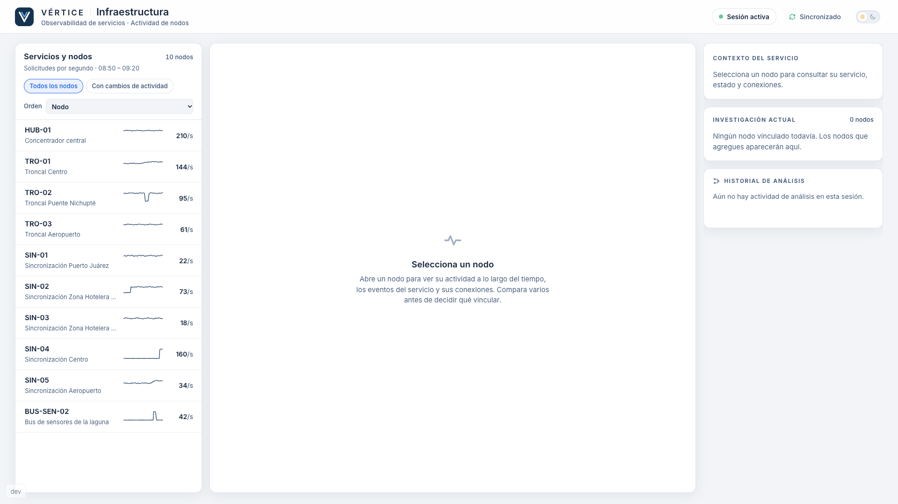
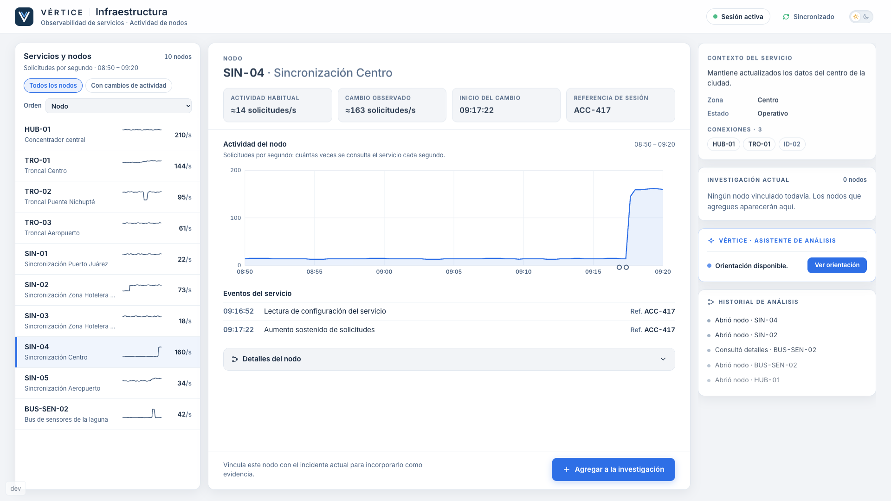
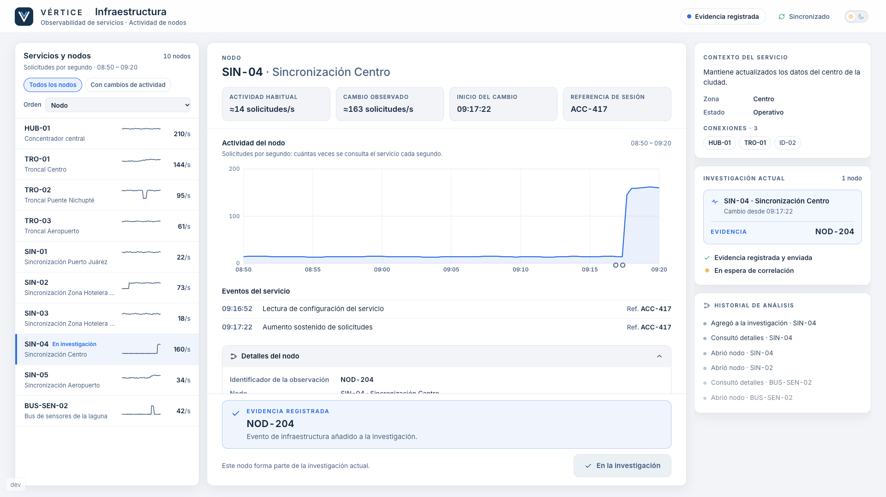

# Estación 03 — Infraestructura (v1)

Observabilidad de servicios de VÉRTICE: qué nodos cambian de actividad, cuándo, con qué referencia y si el cambio tiene explicación.
No es una herramienta técnica de redes: no requiere conocer protocolos, puertos ni comandos («solicitudes por segundo» se explica en pantalla).

| Activa | Nodo abierto | Evidencia registrada |
|---|---|---|
|  |  |  |

## Objetivo y ruta

Descubrir **qué servicio cambia de comportamiento después del acceso anómalo y antes de las alertas posteriores** (`docs/03-game-design.md`, Hilo C).

```text
http://localhost:5173/station/infraestructura     (junto a  /,  /station/comunicaciones  y  /station/identidad, en el mismo navegador)
```

Modo portátil: una computadora, sin red. Usa `useMissionClient()`, el marco `StationShell`, `InvestigationRail`, el Analysis Assistant y el
transporte existentes. No añade transporte, servidor ni reglas al Mission Engine.

## Evidencia y datos canónicos

Evidencia **`NOD-204`** · fuente **`infraestructura`** · nodo **`SIN-04`**: inicio `09:17:22`, ≈14 → ≈163 solicitudes/s, referencia de sesión `ACC-417`.
Distractor **`BUS-SEN-02`**: pico a `09:12:40` (≈40 → ≈231, el mayor de la lista) que corresponde a una sincronización programada y documentada.

Diez nodos (`src/stations/infrastructure/data.ts`), todos con la misma gráfica y el mismo panel; ninguno se marca ni se colorea:

| Nodo | Comportamiento | Contexto inspeccionable |
|---|---|---|
| `HUB-01` | el de mayor tráfico, estable | sin cambios |
| `SIN-04` | 14 → 163 desde 09:17:22, sostenido | referencia `ACC-417` |
| `BUS-SEN-02` | pico 09:12:40–09:14:30 y vuelta a lo habitual | tarea programada `PROG-0912` + documentación |
| `SIN-02` | sube a las 08:55 y se mantiene («Carga alta») | ventana de soporte, referencia `ACC-406` (otra sesión) |
| `TRO-02` | caída y recuperación | mantenimiento `MNT-118` |
| `TRO-01`, `SIN-05` | incremento gradual / leve | patrón habitual |
| `TRO-03`, `SIN-01`, `SIN-03` | estables | — |

Las series de actividad se generan de forma determinista a partir del nivel habitual y del cambio de cada nodo (no hay cientos de eventos).
Los identificadores `NOD-201…210` de las observaciones son ficticios salvo `NOD-204`.

## Cómo se descubre

1. El equipo explora los nodos (miniatura de actividad y **pico** del periodo en la lista —no un valor «actual», porque los datos son estáticos—; orden por nombre o por mayor pico; filtro «Con cambios de actividad»).
2. Abre `BUS-SEN-02`: tiene el mayor pico, pero sus eventos y su documentación muestran una sincronización programada. Se descarta **por contexto, no por color**.
3. Abre `SIN-04`: habitual ≈14, cambio ≈163, inicio 09:17:22, referencia de sesión `ACC-417` (la que el equipo tiene en Identidad; la estación no
   dice qué significa). El identificador `NOD-204` está en **Detalles del nodo**.
4. Con **Agregar a la investigación** (abrir el nodo no basta) se emite **una vez**:

   ```ts
   { type: 'EVIDENCE_DISCOVERED', evidenceId: 'NOD-204', source: 'infraestructura' }
   ```
5. Otro nodo → «La actividad seleccionada no presenta suficiente relación temporal con el incidente actual.» (sin cambio) o «El cambio observado
   tiene contexto operativo suficiente para no vincularlo todavía.» (con explicación documentada). Nunca dice «incorrecto» ni qué nodo es.
6. Tras registrar: «EVIDENCIA REGISTRADA · NOD-204», «Evidencia registrada y enviada» y «En espera de correlación». No muestra `AGR-27`.

## Analysis Assistant

Mismo motor que Identidad (`docs/stations/identidad.md`); esta estación solo aporta su plan (`assistant.ts`) y su fila en `assistant/config.ts`:
orientación → método → patrón → revisión sugerida. **Ninguno nombra `SIN-04` ni `NOD-204`.** Acciones: «Comparar actividad por hora» y «Revisar
referencias de sesión» enfocan un panel; «Ver cambios recientes» aplica el filtro. Ninguna selecciona, abre ni vincula un nodo. Progreso mínimo:
abrir un nodo, Detalles, filtro/orden nuevos; un vínculo fallido cuenta como intento.

## Mission Engine y reset

La estación no contiene ninguna regla de correlación: solo emite `NOD-204`. Con `COR-512` y `ACC-417` el motor guarda las tres evidencias, en
cualquier orden (late join incluido: la estación abre en ACTIVE y recupera la sesión por el replay del host). `MISSION_RESET` la devuelve a
«Estación preparada» y limpia su UI y el asistente. Sin controles de desarrollo en la estación; el ensayo se hace desde la Consola de facilitación (`docs/pilot/facilitator-console.md`).

## Limitaciones conocidas

- Sin reloj de misión compartido: los datos son estáticos (08:50–09:20) mientras VÉRTICE arranca su cronología en 09:15:58 (misma deuda que
  Comunicaciones e Identidad). El asistente no depende de ello.
- Las cifras y los nodos secundarios son ficticios; la dificultad no se ha probado con alumnos.
- Las conexiones a nodos de otros dominios (`ID-xx`, `SEN-xx`) se muestran pero no son navegables.
- No hay tests automáticos propios de esta estación (decisión de la fase piloto); se validó manualmente en el navegador.
