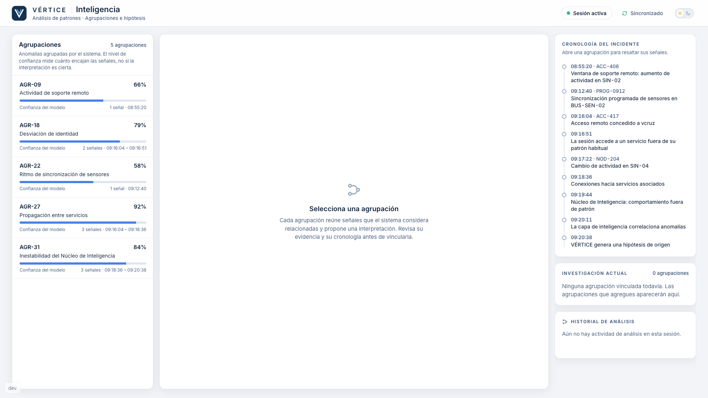
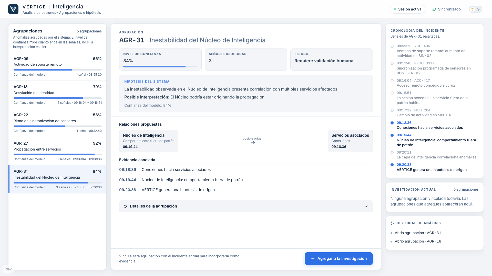
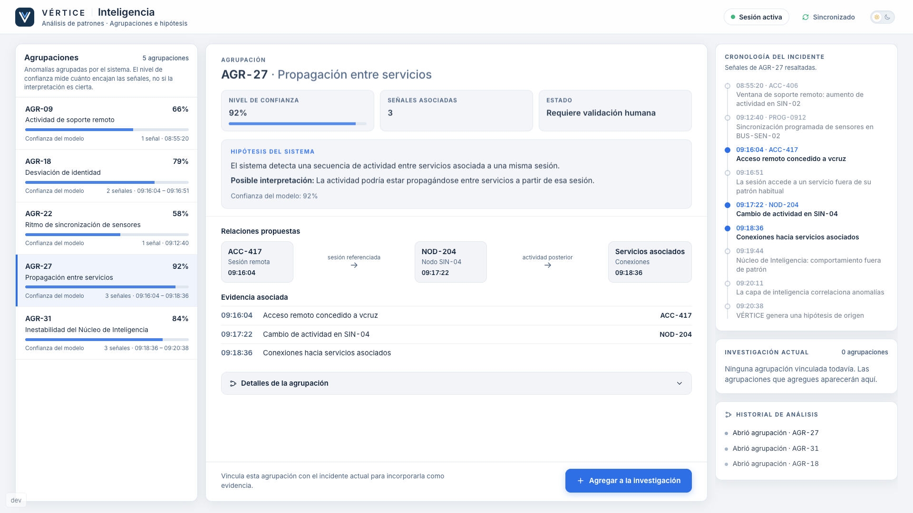
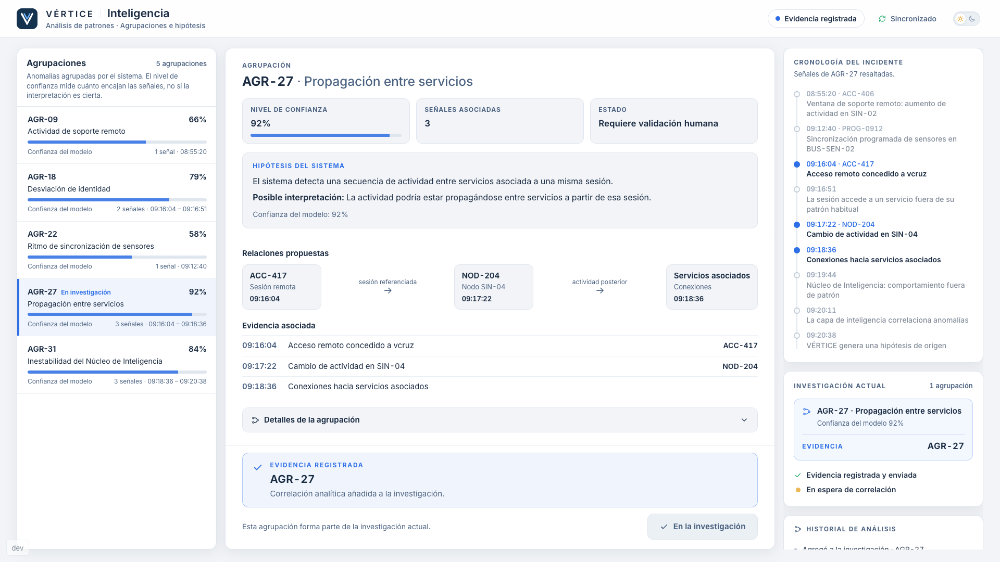

# Estación 04 — Inteligencia (v1)

Herramienta analítica de VÉRTICE: agrupa anomalías, asigna un nivel de confianza, propone hipótesis y muestra relaciones y cronología.
No es un chatbot. Enseña que **una confianza alta no es certeza** y que **correlación no es causalidad**: la IA acelera el análisis y detecta patrones;
el equipo aporta contexto y criterio.

| Activa | AGR-31 abierto | AGR-27 abierto | AGR-27 registrado |
|---|---|---|---|
|  |  |  |  |

## Propósito y ruta

```text
http://localhost:5173/station/inteligencia     (junto a  /  y las otras tres estaciones, en el mismo navegador)
```

Modo portátil: una computadora, sin red. Reutiliza `useMissionClient()`, `StationShell`, `InvestigationRail`, el Analysis Assistant y el transporte existentes.

## Agrupaciones

| Agrupación | Confianza | Señales (cronología) | Papel |
|---|---|---|---|
| `AGR-18` Desviación de identidad | 79% | 09:16:04 acceso · 09:16:51 servicio fuera de patrón | relevante, pero no explica la propagación |
| `AGR-27` Propagación entre servicios | 92% | 09:16:04 `ACC-417` → 09:17:22 `NOD-204` → 09:18:36 servicios asociados | **evidencia `AGR-27`** |
| `AGR-31` Inestabilidad del Núcleo de Inteligencia | 84% | 09:18:36 servicios · 09:19:44 Núcleo fuera de patrón · 09:20:38 hipótesis | hipótesis plausible: «el Núcleo podría estar originando la propagación» |
| `AGR-09`, `AGR-22` | 66%, 58% | 08:55:20 soporte remoto · 09:12:40 sincronización programada | contexto (reutilizan los distractores de Identidad e Infraestructura); sin subtramas |

Todas se presentan con el mismo formato (nivel de confianza, señales, «Hipótesis del sistema», relaciones propuestas, evidencia asociada, «Requiere
validación humana») y la misma barra neutra: ninguna se pinta de verde o rojo y ninguna etiqueta dice si es acertada. La confianza se llama
«Nivel de confianza» / «Confianza del modelo», nunca certeza ni probabilidad de acierto.

## Cronología y cómo se cuestiona AGR-31

La columna derecha muestra la **cronología del incidente** (9 hechos, en orden, `src/stations/intelligence/data.ts`); al abrir una agrupación se resaltan sus señales
y el resto queda atenuado pero legible. Con `AGR-31` abierta se ve que `NOD-204` (09:17:22) aparece antes que el comportamiento del Núcleo (09:19:44) y que la flecha
propuesta («posible origen») va de 09:19:44 hacia 09:18:36. La UI no lo dice: lo concluye el equipo («el Núcleo puede ser consecuencia, no causa»).

## Evidencia y feedback

Evidencia **`AGR-27`** · fuente **`inteligencia`**. Abrir una agrupación no registra nada; «Agregar a la investigación» emite **una vez**:

```ts
{ type: 'EVIDENCE_DISCOVERED', evidenceId: 'AGR-27', source: 'inteligencia' }
```

- `AGR-31`: «La hipótesis presenta correlación, pero la secuencia temporal no establece suficiente soporte causal para vincularla como origen. Revisa qué ocurrió primero.»
- `AGR-18`: «La agrupación describe una desviación relevante, pero no explica suficientemente la propagación observada entre servicios.»
- `AGR-09`/`AGR-22`: «La agrupación no presenta suficiente relación con la secuencia del incidente actual.»
- `AGR-27`: «EVIDENCIA REGISTRADA · AGR-27 · Correlación analítica añadida a la investigación.», «Evidencia registrada y enviada», «En espera de correlación».

## Analysis Assistant

Mismo motor (`docs/stations/identidad.md`); esta estación aporta su plan (`assistant.ts`) y su fila en `assistant/config.ts`: orientación («una confianza alta… no demuestra qué ocurrió
primero») → método (comparar la cronología de cada agrupación) → patrón (propagación vs. consecuencia posterior) → revisión sugerida (comparar el inicio de `NOD-204` con el
comportamiento del Núcleo). No dice qué agrupación es correcta o equivocada. Acciones: «Comparar cronología», «Revisar evidencia asociada», «Contrastar hipótesis»; solo enfocan paneles.

## Mission Engine y reset

La estación solo emite `AGR-27`; no hay reglas de correlación, autorización ni progresión aquí. Con `COR-512`, `ACC-417` y `NOD-204` el motor guarda las cuatro evidencias, en cualquier
orden (late join incluido: la estación abre en ACTIVE y recupera la sesión por el replay del host). `MISSION_RESET` la devuelve a «Estación preparada» y limpia UI y asistente.
`?dev=true` reutiliza `StationDevPanel` (iniciar, marcar `AGR-27`, reiniciar, asistente).

## Limitaciones conocidas

- Sin reloj de misión compartido: las horas son datos estáticos (misma deuda que las demás estaciones). La cronología no reacciona a las evidencias encontradas en otras estaciones.
- Las agrupaciones `AGR-09`/`AGR-22`, sus cifras y los textos de las hipótesis son ficticios; no se ha probado la dificultad con alumnos.
- Sin tests automáticos propios (decisión de la fase piloto); validada manualmente en el navegador.
