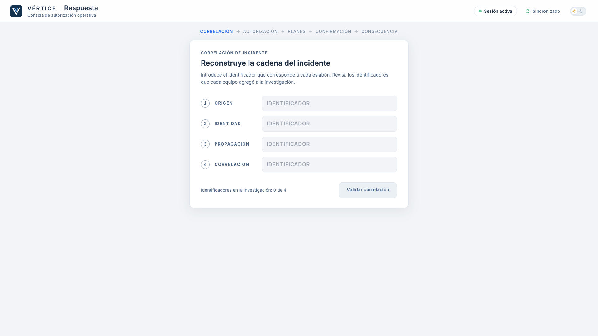
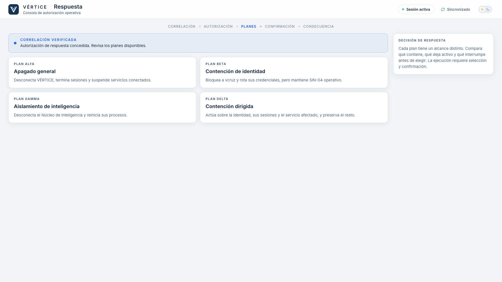
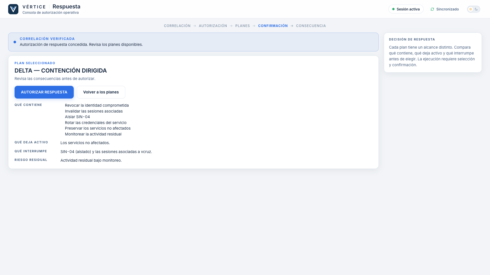
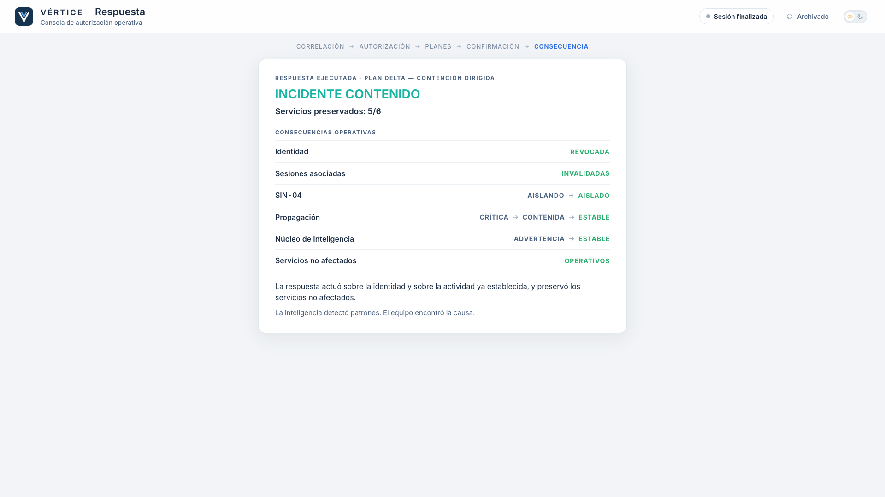
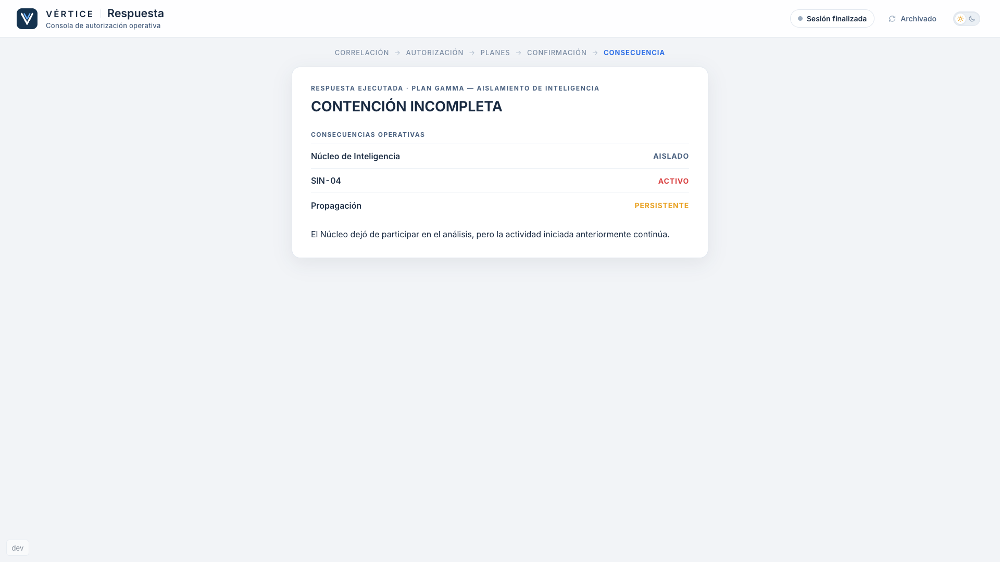
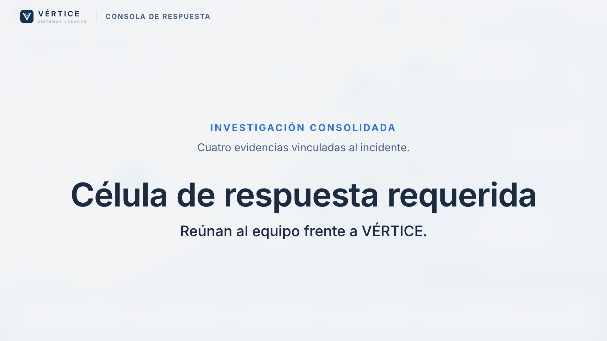
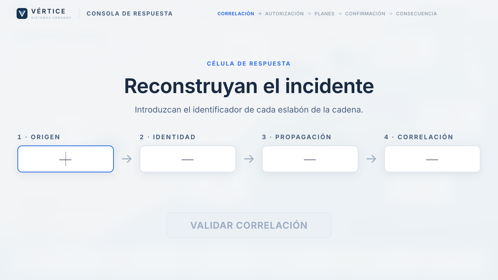
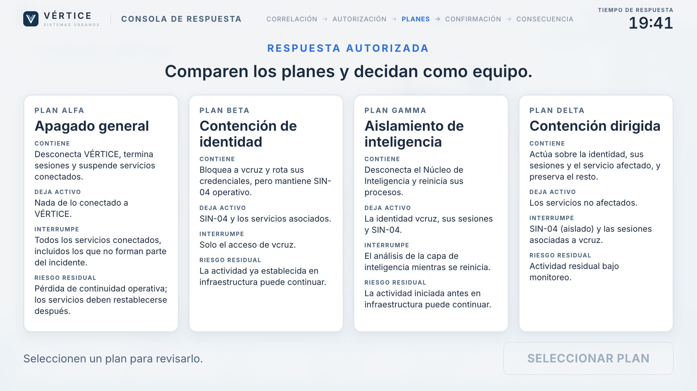
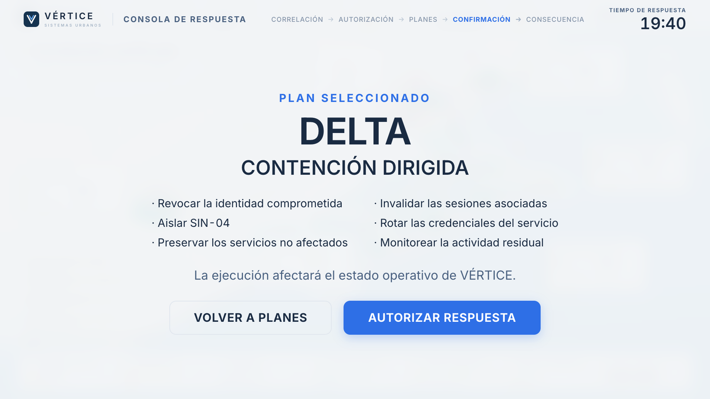
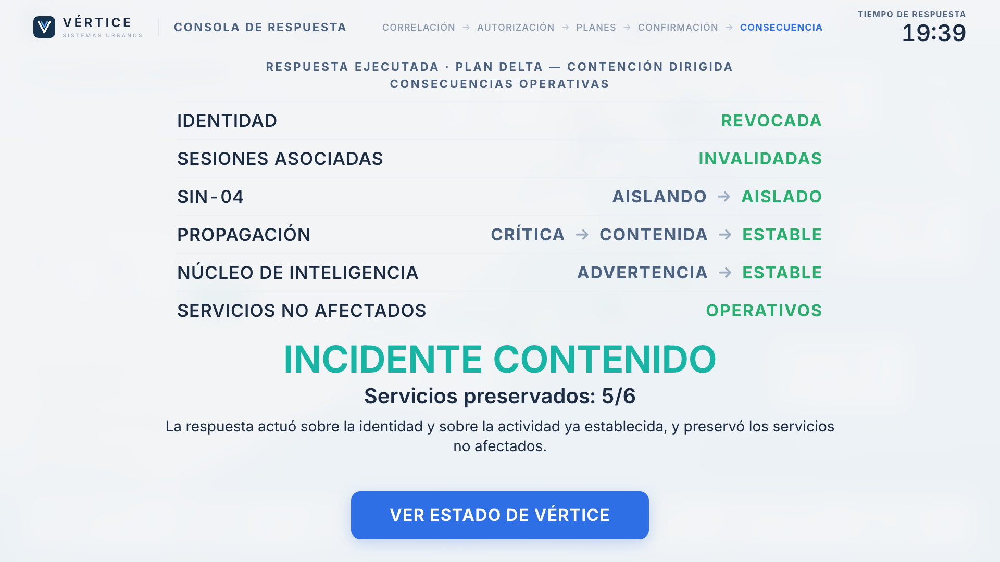

# Estación 05 — Respuesta (v1)

Consola de autorización operativa: primero el equipo **demuestra** que reconstruyó el incidente (candado de correlación) y después **decide** una respuesta entre cuatro planes.
No es un examen: la decisión produce consecuencias operativas, nunca «correcto/incorrecto».

| Candado | Planes | Confirmación (DELTA) | Contención exitosa | Contención incompleta (GAMMA) |
|---|---|---|---|---|
|  |  |  |  |  |

## Ruta y etapas

```text
http://localhost:5173/station/respuesta     (junto a  /  y las otras cuatro estaciones, en el mismo navegador)
```

La etapa se **deriva** de `MissionState` (no hay estado paralelo de decisión):

| Etapa | Condición en el Mission Engine |
|---|---|
| Correlación (candado) | `!finalCorrelationValidated` |
| Autorización | `finalCorrelationValidated && !responseUnlocked` — «Autorización de respuesta pendiente» |
| Planes | `responseUnlocked`, sin `selectedPlan` (o el equipo pidió «Volver a los planes») |
| Confirmación | `selectedPlan` definido |
| Consecuencia | `outcome !== null` |

Late join: la estación abre directamente en la etapa que corresponde (candado, planes o consecuencia); no se repiten pasos ya resueltos.

## Candado y clave

Cuatro campos bajo categorías neutrales: **ORIGEN · IDENTIDAD · PROPAGACIÓN · CORRELACIÓN** (sin nombrar estaciones). **No se autocompleta** aunque el motor ya tenga las cuatro evidencias.
Se normaliza el formato (`cor512`, `COR 512` → `COR-512`). Clave canónica: `COR-512 / ACC-417 / NOD-204 / AGR-27`.
«Validar correlación» solo se habilita con **4 de 4** identificadores en la investigación (restricción de UX; el motor no cambia): mientras falten, «Continúa la investigación antes de validar la correlación» (sin decir cuál falta).
El envío es `FINAL_CORRELATION_SUBMITTED` al Mission Engine (la única validación). Si no coincide: «La correlación propuesta no puede validarse con la evidencia
disponible. Revisa origen, identidad, propagación y correlación antes de volver a enviar.» (sin señalar campo, sin penalización, reintentable).

## Autorización

Al validarse aparece **CORRELACIÓN VERIFICADA**. La estación **no** dispara `RESPONSE_UNLOCKED` ni adelanta el reloj: el host VÉRTICE lo hace por cronología
(`RESPUESTA_AUTORIZADA`, 09:21:05 simulado). Mientras tanto muestra «VÉRTICE está completando la validación operacional. Autorización de respuesta pendiente.»
y, al llegar `responseUnlocked`, «Autorización de respuesta concedida» y los planes.

## Planes y decisión

Los cuatro con el **mismo peso visual** (sin colores, marcas ni recomendaciones). Al abrir uno se compara *qué contiene, qué deja activo, qué interrumpe y qué riesgo residual conserva*:
ALFA — Apagado general · BETA — Contención de identidad · GAMMA — Aislamiento de inteligencia · DELTA — Contención dirigida (`logic.ts`).
Flujo: revisar → **Seleccionar plan** (`PLAN_SELECTED`) → resumen «PLAN SELECCIONADO … Revisa las consecuencias antes de autorizar» → **AUTORIZAR RESPUESTA** (`PLAN_CONFIRMED`).
Un clic accidental no ejecuta nada; se puede volver a los planes antes de autorizar.

## Consecuencias

El Mission Engine calcula `outcome` (`DELTA` → `contained`; el resto → `incomplete`); la estación conserva `selectedPlan` para mostrar la consecuencia **específica**:
DELTA — Identidad REVOCADA · Sesiones INVALIDADAS · SIN-04 AISLANDO→AISLADO · Propagación CRÍTICA→CONTENIDA→ESTABLE · Núcleo ADVERTENCIA→ESTABLE · Servicios no afectados OPERATIVOS, con
«INCIDENTE CONTENIDO · Servicios preservados: 5/6». ALFA — actividad detenida, pero servicios saludables fuera de línea. BETA — identidad contenida, SIN-04 activo y actividad residual.
GAMMA — Núcleo aislado, pero SIN-04 activo y propagación persistente (correlación ≠ causalidad, sin sermón).
**Respuesta explica la decisión; VÉRTICE la dramatiza** (es una pantalla distinta).

## Corrección compartida: VÉRTICE observa `mission.outcome`

Antes, el cambio visual del desenlace vivía en `confirmPlan()` de VÉRTICE, que solo se ejecuta si el plan se confirma **localmente**. Como Respuesta es un cliente separado, el host recibía
`PLAN_CONFIRMED` por el transporte y `outcome` cambiaba, pero el mundo no. Ahora `useMission` reacciona a `mission.outcome` (efecto con la transición anterior, sin bucles):
`contained` → `CONTENCION_EXITOSA`, `incomplete` → `CONTENCION_INCOMPLETA`, sin importar el origen del evento. Si `outcome` vuelve a `null` con el mundo en un desenlace (reset remoto),
el mundo vuelve a operación normal. `confirmPlan()` sigue existiendo y solo despacha el evento. No se tocó el transporte ni el reducer.

## Analysis Assistant

Mismo motor; plan propio (`assistant.ts`) y fila en `assistant/config.ts`. Solo aparece en la etapa de decisión y su temporizador se reinicia al recibir la autorización. Orienta sobre alcance,
continuidad, riesgo residual y servicios saludables; **nunca nombra un plan como la elección** ni entrega identificadores. En el candado no hay asistente: solo el recordatorio fijo
«Revisa los identificadores que cada equipo agregó a la investigación.»

## Reset

`MISSION_RESET` deja `selectedPlan`, `outcome`, `finalCorrelationValidated` y `responseUnlocked` en su estado inicial (reducer), Respuesta vuelve a «Estación preparada» con el candado vacío, y VÉRTICE a operación normal
(tanto si el reset se hace en VÉRTICE como desde una estación con `?dev=true`).

## Respuesta en la pantalla LED (modo laboratorio)

En el laboratorio no hay una quinta computadora: son **4 estaciones físicas** (Comunicaciones, Identidad, Infraestructura, Inteligencia) y **la fase final ocurre en VÉRTICE (LED)**.
Es una **segunda presentación del mismo flujo**: misma lógica (`useResponseFlow`, `deriveStage`), mismos eventos (`FINAL_CORRELATION_SUBMITTED`, `PLAN_SELECTED`, `PLAN_CONFIRMED`),
mismos contenidos (`PLANS`, `OUTCOMES`, `normalizeId`). El Mission Engine no cambia. Componente: `src/ui/ResponseStage.tsx`.

| Transición | Candado | Planes | Confirmación | Consecuencia |
|---|---|---|---|---|
|  |  |  |  |  |

- **Detección:** VÉRTICE observa `mission.discoveredEvidence` y comprueba los cuatro identificadores canónicos (`EVIDENCE_IDS.every(...)`). Con menos de cuatro, el mapa se ve exactamente como antes.
- **Transición grupal (~3 s):** «INVESTIGACIÓN CONSOLIDADA · Cuatro evidencias vinculadas al incidente» y «CÉLULA DE RESPUESTA REQUERIDA · Reúnan al equipo frente a VÉRTICE». Es la señal para que todos se reúnan frente a la LED.
- **Después, la consola** se dibuja sobre el mapa (atenuado), en el lienzo 1920×1080, con campos y botones grandes para operar con mouse y teclado desde la computadora de la LED:
  1. **Candado:** cadena ORIGEN → IDENTIDAD → PROPAGACIÓN → CORRELACIÓN, sin autocompletar; mismo rechazo neutral («Revisen origen, identidad, propagación y correlación»).
  2. **Autorización operativa en curso** mientras `finalCorrelationValidated && !responseUnlocked` (no vuelve al mapa; no adelanta el reloj ni dispara `RESPONSE_UNLOCKED`).
  3. **Respuesta autorizada:** los cuatro planes en columnas de igual peso visual (alcance · deja activo · interrumpe · riesgo residual), luego «SELECCIONAR PLAN» → confirmación → «AUTORIZAR RESPUESTA». La confirmación repite de forma compacta *actúa sobre · preserva / deja activo · interrumpe · riesgo residual* justo antes de autorizar.
  4. **Consecuencia** del plan ejecutado en grande (mismo contenido que `OutcomePanel`) y, cuando el grupo termina de leer, el botón **VER ESTADO DE VÉRTICE**, que regresa al mapa en `CONTENCION_EXITOSA` o `CONTENCION_INCOMPLETA`.
- **Derivado de la misión:** la etapa sale de `MissionState` (candado / pendiente / planes / confirmación / consecuencia). Solo la introducción de 3 s y el «ya lo leímos» del desenlace son estado local de presentación. Recargar VÉRTICE sigue reiniciando la misión.
- **Reset:** «Restablecer» limpia la consola (plan abierto, campos, desenlace reconocido) y VÉRTICE vuelve a operación normal.
- **Atajos de facilitación:** mientras la consola está a la vista se desactivan `1`–`7`, `R` y espacio (no se puede reiniciar o mover el reloj por un toque accidental); `D` (panel de facilitación), `M` y `F` siguen activos.
- **Portátil:** la ruta `/station/respuesta` sigue disponible y funciona igual. Si se usa junto con VÉRTICE (misma misión), ambas vistas se mantienen coherentes: un plan confirmado en la estación aparece como consecuencia en la LED.

## Limitaciones conocidas

- El mapa de VÉRTICE tiene un solo desenlace «Contención incompleta» para ALFA, BETA y GAMMA; la consecuencia específica de cada uno se ve en la consola de respuesta (estación o LED) antes de volver al mapa.
- Las horas de la autorización dependen del reloj simulado de VÉRTICE (sin reloj compartido). Con velocidad normal, la autorización llega ~9 min después de iniciar; en pruebas se usa `?speed=`.
- Tras `PLAN_CONFIRMED` el motor marca la misión como `finished`: las demás estaciones muestran «Sesión finalizada».
- No hay debrief, estadísticas ni puntuación (fuera del alcance). Sin tests automáticos propios (fase piloto); validado manualmente en el navegador.
